# SmartLink Device Controller

SmartLink is a full-stack IoT/BLE device control portfolio project built to demonstrate Flutter mobile development, Bluetooth Low Energy architecture, Java/Spring Boot backend integration, and Vue 3 administration tools. The mobile app discovers and connects to smart devices, drives three intensity channels in real time, switches operating modes, designs multi-step control patterns and keeps devices, presets and session history in sync with a cloud account that an admin dashboard manages.

**Flutter · Riverpod · GoRouter · BLE · Spring Boot · MyBatis-Plus · Vue 3 · Redis · MySQL**

## Screenshots

### Mobile Application

<p align="center">
  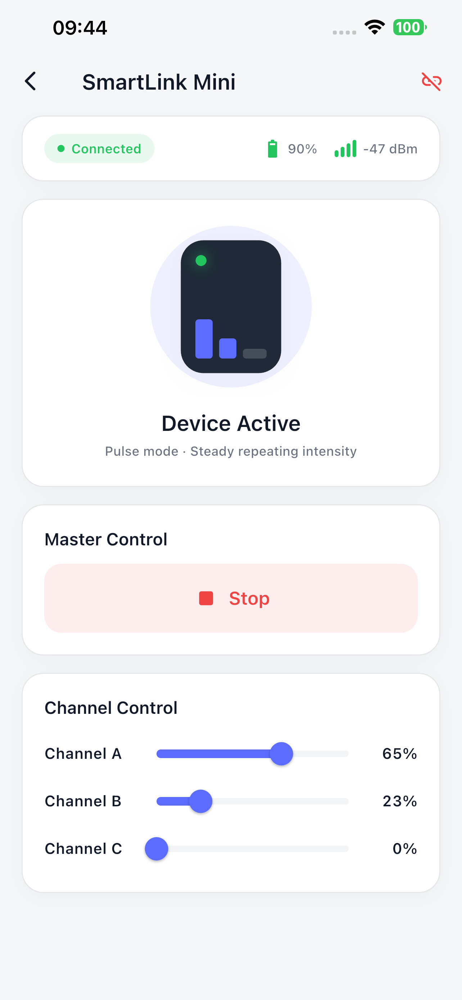
  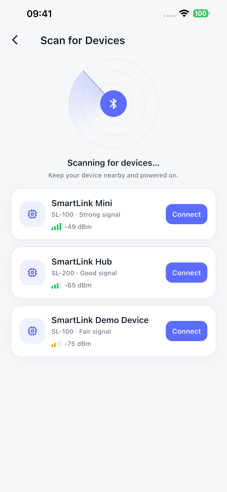
  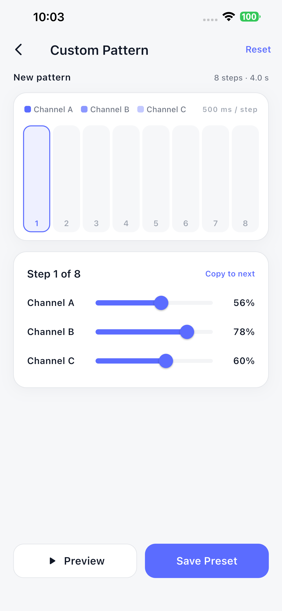
</p>
<p align="center">
  <sub>Device Control &nbsp;·&nbsp; Scan for Devices &nbsp;·&nbsp; Custom Pattern Editor</sub>
</p>

<p align="center">
  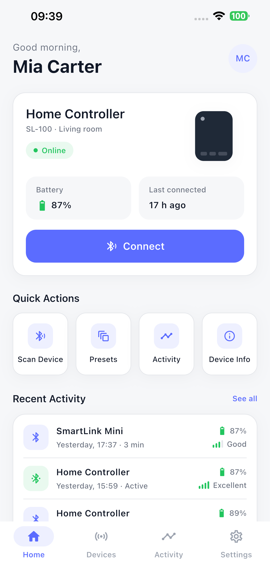
  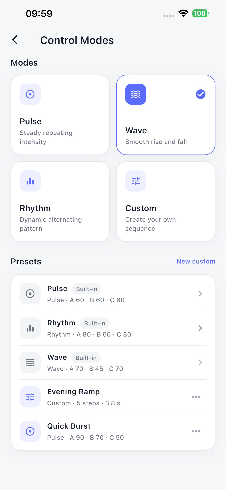
  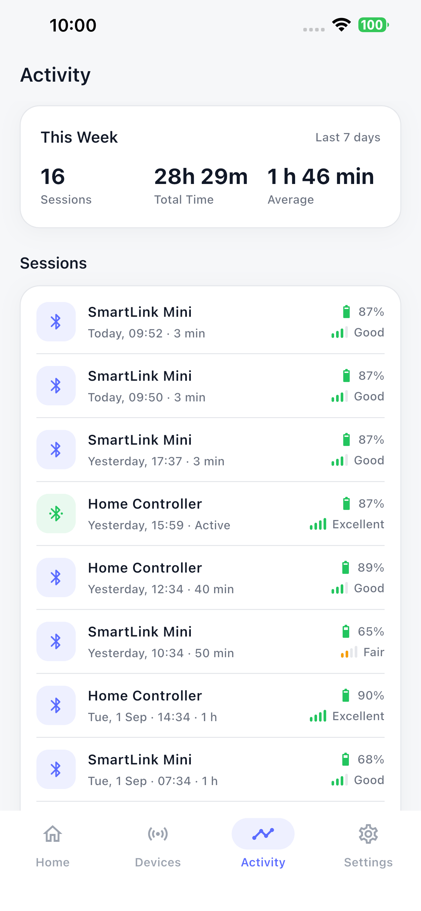
</p>
<p align="center">
  <sub>Home Dashboard &nbsp;·&nbsp; Control Modes &nbsp;·&nbsp; Activity History</sub>
</p>

<p align="center">
  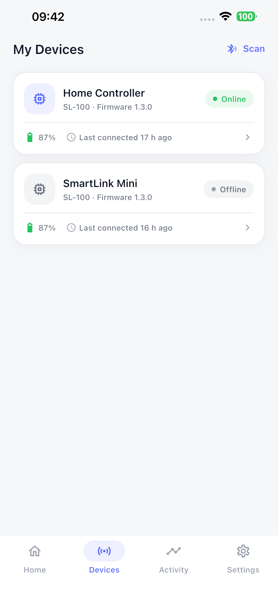
</p>
<p align="center">
  <sub>My Devices</sub>
</p>

### Admin Dashboard

The SmartLink system also includes a Vue 3 + Arco Design administration dashboard backed by the same Spring Boot services. It manages devices, app users, control presets and connection history, with ECharts trend charts on the overview page.

<p align="center">
  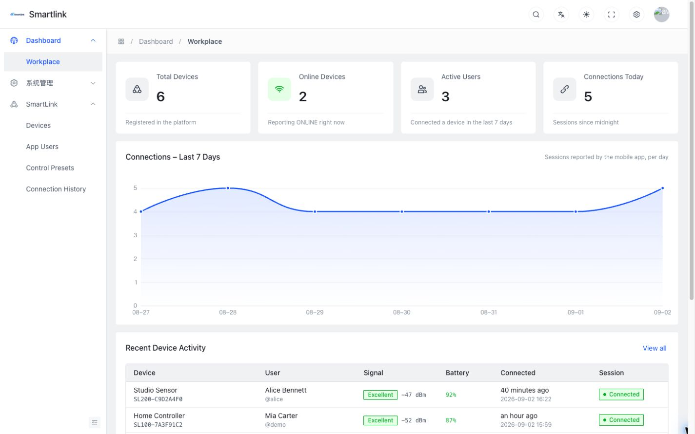
</p>
<p align="center">
  <sub>Dashboard — device totals, active users, connections over the last 7 days, recent activity</sub>
</p>

<p align="center">
  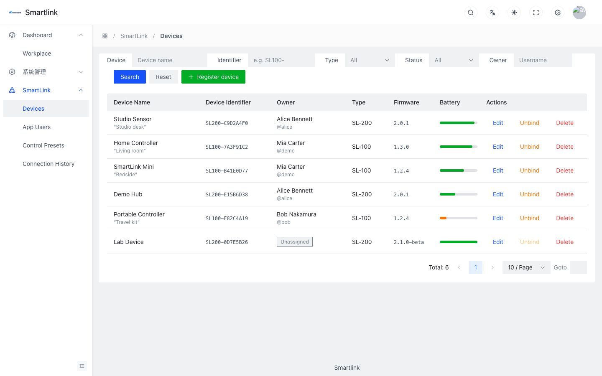
</p>
<p align="center">
  <sub>Device management — owner, firmware, battery, status, unbind</sub>
</p>

<p align="center">
  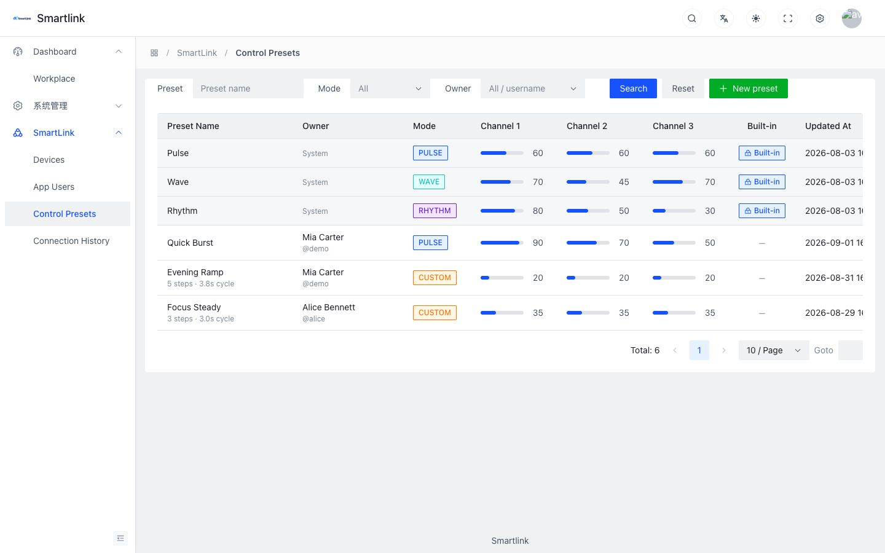
</p>
<p align="center">
  <sub>Control presets — built-in vs. user presets, mode and channel values</sub>
</p>

<p align="center">
  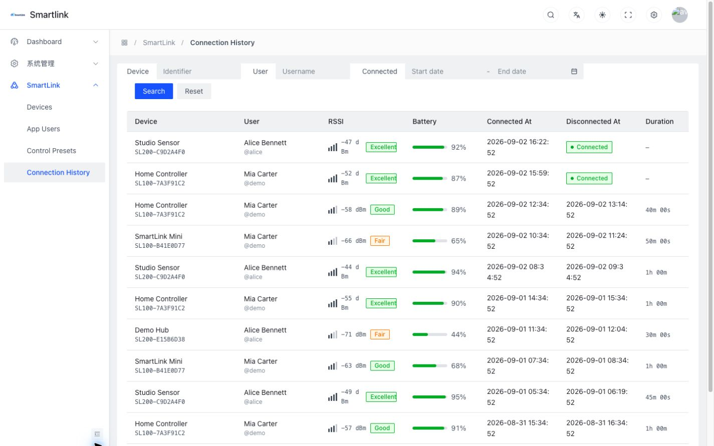
</p>
<p align="center">
  <sub>Connection history — device, user, signal quality, battery, duration</sub>
</p>

## Key Features

**Mobile**

- BLE device discovery with signal-quality display
- Mock BLE connection lifecycle: scanning → connecting → connected → disconnected
- RSSI and battery simulation with live device notifications
- Real-time three-channel intensity control (throttled slider commands)
- Device start / stop control
- Preset modes: Pulse, Wave, Rhythm, Custom
- Custom 8-step control patterns with a timeline editor
- Pattern preview executed on the (simulated) device
- Device connection history with a weekly summary
- Real backend authentication and data synchronization (devices, presets, history)

**Backend** (private source)

- Java / Spring Boot REST API with MyBatis-Plus on MySQL
- Redis for dashboard caching and instant token revocation
- JWT/token-based authentication
- Device ownership and binding rules enforced server-side
- Preset persistence, connection history, dashboard statistics

**Admin** (private source)

- Device management, app user management
- Control preset management
- Connection history
- Dashboard statistics

## Architecture

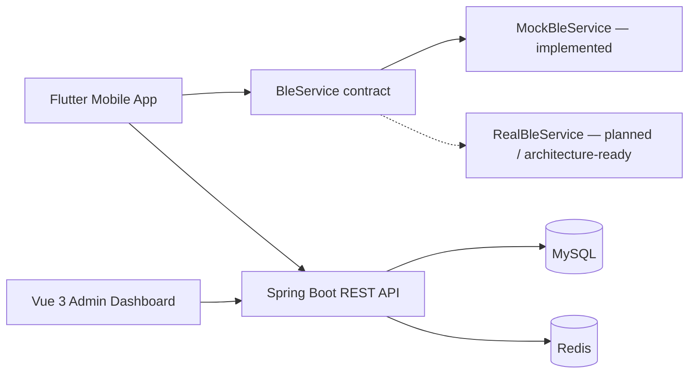

The Flutter client is organised feature-first in three layers: pages and widgets depend on Riverpod providers and the `BleService` contract; providers (`AsyncNotifier`, `Notifier`, `StreamProvider`) own state; repositories and the BLE implementation talk to the outside world. A single controller orchestrates the connect flow end to end — BLE connect, cloud ownership check, status report, session — and closes the session on disconnect with a best-effort history report. The API layer maps HTTP status codes and backend business codes to a small exception hierarchy with user-facing copy, so pages never display transport errors.

## BLE Design

The public portfolio currently implements:

```
BleService
└── MockBleService
```

`BleService` exposes scan results, connection state and device state as streams, plus `startScan / stopScan / connect / disconnect / setIntensity / start / stop / setMode`. **MockBleService** simulates:

- BLE discovery (devices appear over time with jittered RSSI)
- connection states (connecting, connected, disconnecting, disconnected)
- RSSI and battery, refreshed through periodic device notifications
- channel control, start/stop and mode changes, each encoded as a 3-byte command (`[command, channel, value]`) and reflected in the observed device state

The UI depends only on `BleService`; `ble/ble_provider.dart` is the single place that chooses the implementation. A future `RealBleService` can be added behind the same contract without changing UI code. Physical BLE hardware support is not part of the public version.

## Backend / Admin Source

The Flutter client source is public in this repository.

The Java/Spring Boot backend and the Vue 3/Arco Design admin dashboard were implemented as part of the full SmartLink demo system, but their source repositories are intentionally kept private. Screenshots and architecture details are included for portfolio demonstration.

The client consumes a small REST surface (`/app/auth`, `/app/devices`, `/app/presets`, `/app/history`) with a `{ code, msg, data }` envelope and a token header. Custom patterns are stored as JSON steps, e.g. `[{"ms":500,"ch":[20,40,60]}, …]`.

## Project Structure

```
lib/
  app/        MaterialApp, GoRouter routes, design tokens / theme
  core/       API client, storage, utilities, shared widgets
  features/   auth, home, devices, scan, control, presets, history, activity, settings, shell
  ble/        BleService contract, models, command encoder, MockBleService, providers
test/         unit tests + optional backend integration test
docs/
  screenshots/
```

Each feature folder holds its own models, repository, providers and pages, so a screen can be understood by reading one directory. Shared building blocks (cards, buttons, badges, banners, empty/loading/error views) live in `core/widgets` and every screen composes the same set.

## Getting Started

```bash
flutter pub get
flutter run --dart-define=API_BASE_URL=http://YOUR_API_HOST:8081
```

- iOS Simulator can normally use `localhost` (the default when no override is given).
- Android Emulator can normally use `10.0.2.2` (the default on Android).
- Physical devices need an accessible backend IP/hostname passed through `API_BASE_URL`.

The simulated Bluetooth stack works without any hardware. Cloud features (sign-in, devices, presets, history) require the private backend to be reachable.

## Demo Account

| Username | Password  |
|----------|-----------|
| `demo`   | `demo123` |

Local portfolio demo credentials for the private seed database. This is not a public production account.

## Quality

Verified on the current revision:

- `flutter analyze` — no issues
- `flutter test` — all tests passing (BLE command encoder, mock BLE service, API response mapping, pattern data and player, activity summary)
- Android debug build — successful
- iOS simulator debug build — successful

## Limitations

- Bluetooth currently uses `MockBleService`; physical hardware integration is not included in the public version.
- Backend and admin source remains private; without a reachable backend the app stops at the sign-in screen.
- Cleartext HTTP permissions (`NSAllowsArbitraryLoads`, `usesCleartextTraffic`) exist only to support local portfolio development/demo workflows against a LAN backend.
- Device models, identifiers and the 3-byte protocol are invented for this project.

## Portfolio Purpose

This project was created as an original engineering portfolio demonstration of Flutter, BLE/IoT architecture, backend API integration, and full-stack product development. The source is published for reading and evaluation; no open-source license is granted at this time.
